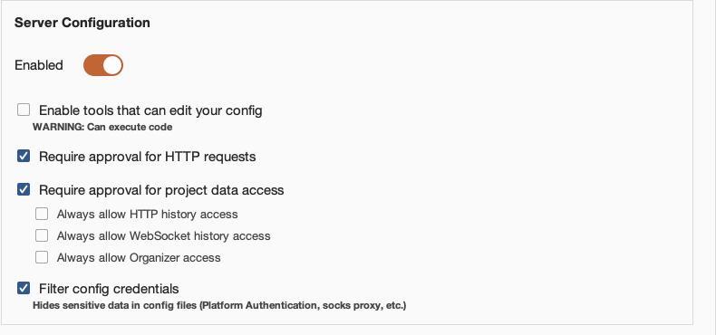

# Security research over MCP

|  |  |
|---|---|
| **Section** | [Muse Code](https://dev.meta.ai/docs/cookbook#building-with-muse-code) |
| **Time to complete** | ~90 min |
| **Model** | `muse-spark-1.3-contributor` |
| **Harness** | Muse Code 1.1.1 (the `muse` CLI) |

## Summary

Muse Code is Meta’s terminal coding agent; out of the box it reads code, edits files, and runs shell commands inside an OS-enforced sandbox. What it doesn’t know how to do is drive a web proxy, decompile a binary, or debug a process, and that’s the gap the Model Context Protocol fills.

An MCP server is a process that exposes a set of named, typed tools and nothing else. Wiring Burp in doesn’t hand the model a shell inside Burp; it hands it twenty-four specific functions such as `get_proxy_http_history` and `send_http1_request`. That’s what makes the rest of this tractable, and it’s also where the security boundary sits.

This recipe shows how to wire three security tools into Muse Code as MCP servers, and then put each of them to work on a target that actually has bugs in it.

- [Part one](#part-one---web-endpoints), Burp Suite. The agent reads proxy history, replays requests against PortSwigger’s deliberately vulnerable demo site, and builds its own proof of the lead it picks. This half is set up for you to run rather than read, and the target publishes an answer key so you can grade it yourself. Everything works on Burp Community.
- [Part two](#part-two---native-binaries), Ghidra and LLDB. The agent gets a stripped binary and a file that crashes it, and works back to the root cause of a real CVE in a JPEG 2000 decoder. Also set up for you to run, and the upstream patch is public, so you can grade this one too.

Neither bug is novel, and that’s rather the point; what the agent does is correlate, prove and document, which are the mechanical and attention-hungry parts of security work. Everything here was run end to end rather than transcribed from documentation.

## Setting Up Muse Code

### Install

There’s one shell installer for MacOS and Linux, and it drops a native binary on your path:

```
curl -fsSL https://dev.meta.ai/install.sh | sh
```

Confirm it landed:

```
$ muse --version
Muse Code 1.1.1 (1.1.1-R2514.1)
```

The installer puts the binary in `~/.local/bin` by default, so make sure that’s on your `PATH`.

### Authenticate

Run `muse` in any project directory. On first entry you’ll be asked whether to trust the workspace, and then offered either a browser sign-in or an API key.

```
cd /path/to/your/project
muse
```

For anything scripted, headless, or CI-bound, skip the browser and use an environment key:

```
export META_API_KEY="<your-key>"
```

Or store it once with `muse auth set`. Precedence is `META_API_KEY`, then a stored key, then a stored browser session. You can reopen the sign-in options mid-session with `/login` and clear stored credentials with `muse logout`, though note that `muse logout` won’t unset an exported `META_API_KEY`.

### The Settings File

User settings live at `~/.config/muse/settings.json`; this one file holds model defaults, TUI preferences, hooks, the `runtime_capabilities` map, telemetry options, and MCP servers.

A minimal starting point:

```json
{
  "schema_version": 1,
  "model": "muse-spark-1.3-contributor"
}
```

### How Muse Code Loads MCP Servers

Servers are declared in the `mcp_servers` block of `settings.json`, and MCP configuration lives in this file and only this file.

Each server takes a `transport`, which is one of two values:

| Transport         | Fields                                       | Use it for                                                  |
|-------------------|----------------------------------------------|-------------------------------------------------------------|
| `stdio`           | `command`, `args`, `env`, optional `framing` | Local processes: a Python bridge, a proxy jar, a `uvx` tool |
| `streamable_http` | `url`, `headers`                             | A server already listening on a port                        |

Every server also accepts `enabled`, a boolean toggle so you can park a server without deleting its config, and `mode`, which defaults to `"required"`. If a required server fails to start the whole run aborts:

```
agent loop failed: model failed: invalid run configuration:
Required MCP server `burp` failed during startup: initialization failed.
```

Two practical notes before you add a security tool to this block:

- Set `mode: "optional"` on every tool-backed server. Burp is a GUI app you start by hand and forget to start; on the default `required`, forgetting means Muse Code refuses to run at all in that project until you notice, whereas `optional` degrades to a warning.
- Servers load at startup, so edit `settings.json` and then start a *new* session; there’s no reload.

## Part One - Web Endpoints

The agent gets a proxy it can read, a target it’s allowed to touch, and a bug it has to prove.

### Wiring Up Burp Suite

Everything in this section was run end to end on MacOS with Burp Suite Community 2026.8.0 and Muse Code 1.1.1.

The commands are MacOS-specific, so Homebrew, `/opt/homebrew`, and `/Applications`. On Linux the shape is identical; you install Burp and a JDK through your package manager, and the extension jar lands under `~/.BurpSuite/bapps/` just the same.

#### Installing Burp

```
brew install --cask burp-suite     # Community Edition, free
```

The cask sets a quarantine attribute on the bundle, so launch the app once from Finder and clear the Gatekeeper prompt before doing anything on the command line. Skip this and every later step fails in confusing ways.

#### Installing the Extension

The MCP server is an official BApp and it installs in Community Edition; there’s no Professional requirement for the extension itself. Go to Extensions → BApp Store, search for MCP Server, and click Install.


Burp drops the extension here, which is worth knowing because we’ll need it shortly:

```
~/.BurpSuite/bapps/9952290f04ed4f628e624d0aa9dccebc/burp-mcp-all.jar
```

Then open the new MCP tab and tick Enabled. Confirm the server is actually up:

```
$ lsof -nP -iTCP:9876 -sTCP:LISTEN
COMMAND     PID USER   FD   TYPE  DEVICE SIZE/OFF NODE NAME
JavaAppli 31887 meow   88u  IPv6  0x3d6a…      0t0  TCP 127.0.0.1:9876 (LISTEN)
```

#### Configuring the Approval Layer

Muse Code’s sandbox doesn’t contain MCP tools. The Burp extension, however, ships its own approval layer, and on a default install it’s already on, which means it will interrupt you. It’s worth setting this up before your first run rather than discovering it mid-task.

Here is what a fresh install gives you:



*The default state. Approval is required for outbound requests and project data; the three always-allow toggles are off; the target allowlist is empty.*

In that state the first `get_proxy_http_history` call pops a dialog in Burp and the run blocks until you answer it. That’s fine when you’re sitting in front of the GUI and wrong for anything scripted. Note that this is a *second* approval layer, entirely separate from Muse Code’s own, so `--disable-approval` on the CLI does nothing for it; two layers, two places to configure.

For a walkthrough like this one, switch the page on and get on with the work:


*Everything enabled.*

Expect dialogs even so. The always-allow toggles cover reads; outbound requests are governed separately by *Require approval for HTTP requests*, which stays on. To stop Burp prompting on every `send_http1_request`, add the target host to **Auto-Approved HTTP Targets** on the same page. On a demo target you can just answer the dialogs instead.

#### Bridging SSE to stdio

Burp speaks SSE, while Muse Code speaks `stdio` and `streamable_http`, and SSE is neither of those. Fortunately the extension ships a translator, `mcp-proxy-all.jar`, so the setup ends up being two separate processes:

```
Muse Code --stdio--> proxy (mcp-proxy-all.jar) --SSE 127.0.0.1:9876--> Burp Suite --> target

Burp Suite : launched by you, runs on its bundled JRE
proxy      : launched by Muse (the "command" in the config below), needs a standalone JDK
```

The proxy is bundled inside the BApp, so we’ll pull it out:

```
mkdir -p ~/.local/share/burp-mcp
unzip -p \
  "$HOME/.BurpSuite/bapps/9952290f04ed4f628e624d0aa9dccebc/burp-mcp-all.jar" \
  mcp-proxy-all.jar > "$HOME/.local/share/burp-mcp/mcp-proxy-all.jar"
```

Point the proxy at a standalone JDK (`brew install openjdk`); Burp’s bundled JRE can’t be invoked from the CLI on MacOS.

#### Wiring It Into Muse Code

Here’s the complete `settings.json`. Note that `command` points at the standalone JDK, not the one inside Burp:

```json
{
  "schema_version": 1,
  "model": "muse-spark-1.3-contributor",
  "mcp_servers": {
    "burp": {
      "transport": "stdio",
      "command": "/opt/homebrew/opt/openjdk/bin/java",
      "args": [
        "-jar",
        "/Users/you/.local/share/burp-mcp/mcp-proxy-all.jar",
        "--sse-url",
        "http://127.0.0.1:9876"
      ],
      "mode": "optional"
    }
  }
}
```

### Verifying It End to End

Start a session and ask the agent what it can see. There’s no `/mcp` slash command, so the check is a prompt:

> **Prompt**
>
> List every MCP tool you have available, grouped by which server provides it. Do not call any of them.

A healthy stack answers with the servers grouped and the tools namespaced `mcp__<server>.<tool>`:

```
Available MCP tools (1 server, 24 tools, not called):

**Server: `burp` (`mcp__burp.*`)**

- `mcp__burp.get_proxy_http_history`
- `mcp__burp.send_http1_request`
…
```

That single prompt catches the common failures at once: a server that didn’t start shows up as a startup warning and a missing group, a typo’d `transport` fails validation before the TUI appears, and a `required` server that’s down aborts the run outright.

Then prove a call actually round-trips. `url_encode` is the safest possible choice here, since it touches no network and no state. Ask for it in the same session:

> **Prompt**
>
> Call the burp MCP tool url_encode on the exact string: a b&c=<d> Then report the raw value it returned, nothing else.

```
a+b%26c%3D%3Cd%3E
```

Run this one interactively rather than through `muse exec`. Tool calls go through the approval layer, and a headless run has no UI to answer the prompt with, so it will sit there.

### Pointing It at a Real Target

> **Warning · authorized targets only**
>
> The target here is [ginandjuice.shop](https://ginandjuice.shop), PortSwigger’s deliberately vulnerable demo site, published for exactly this purpose. Do not point any of this at a host you are not authorized to test.

#### Seeding the Proxy History

The agent reads Burp’s history; it doesn’t generate traffic on its own. You can browse the target in Burp’s built-in browser, but driving `curl` through Burp’s proxy listener is faster and reproducible, and it means anyone can replay the exact same corpus.

Burp’s proxy listens on `127.0.0.1:8080` by default:

```
for u in \
  "https://ginandjuice.shop/catalog" \
  "https://ginandjuice.shop/catalog?searchTerm=gin" \
  "https://ginandjuice.shop/catalog?searchTerm=rum" \
  "https://ginandjuice.shop/catalog/product?productId=1" \
  "https://ginandjuice.shop/catalog/product?productId=2" \
  "https://ginandjuice.shop/blog" \
  "https://ginandjuice.shop/blog?searchTerm=cocktail" \
  "https://ginandjuice.shop/login" \
  "https://ginandjuice.shop/my-account" ; do
  code=$(curl -s -x http://127.0.0.1:8080 -k -o /dev/null -w "%{http_code}" -m 20 "$u")
  echo "$code  $u"
done
```

Nine requests, one of them a redirect; that’s the whole corpus the agent gets to reason about.

`-k` skips certificate validation because Burp presents its own CA. That’s fine for scripted seeding; if you’d rather browse the target through Burp in a normal browser, install Burp’s CA from `http://burp/cert` first.

#### Hand It the Goal, Not the Method

The map step is scaffolding. The actual test is whether the agent can pick its own lead and prove it, so the second prompt names no endpoint, no parameter, and no technique:

```
Use the burp MCP tools. I am authorized to test ginandjuice.shop.

There is proxy history for this host already. Start there: work out what the
application's attack surface actually is, pick the single lead you think is most
likely to be a real server-side vulnerability, and confirm or kill it using
send_http1_request.

Rules:
- Discover the parameters yourself. Do not assume the history shows all of them.
- Before you claim anything, prove it: a baseline, a request that breaks it, and
  a request that repairs it. A single anomalous response is not a finding.
- Report what you could NOT determine with these tools, and why.
- Do not extract data. Demonstrate the flaw, don't exploit it.
```

Then leave it alone and watch it work. Gin & Juice is seeded with known bugs and publishes the list, so the finding itself is not really the point. What is worth watching is which endpoints it decides are worth attention, which leads it kills, and whether what it finally claims arrives with a baseline, a break and a repair rather than one odd response.

The run behind this recipe picked a single lead, confirmed it with that three-request pattern, and discarded two competing leads with a stated reason for each. Yours will differ in the details, since the model is non-deterministic and the history you seeded is your own. Grade it against the site’s own [/vulnerabilities](https://ginandjuice.shop/vulnerabilities) page, which is the answer key.

## Part Two - Native Binaries

So far we’ve been hunting network-layer vulnerabilities. Now we’ll go a layer down, to native bugs: a stripped binary, a file that crashes it, and no source. Two more MCP servers, Ghidra for structure and LLDB for runtime values, pointed at a real CVE in a media decoder.

This half needs a few things the web half didn’t: `cmake` and a C toolchain to build the target, `uv` for both MCP servers, and Rosetta to run an x86_64 binary on Apple Silicon. On MacOS that is `brew install cmake uv`, `xcode-select --install`, and `softwareupdate --install-rosetta`.

### Wiring Up Ghidra, Headless

For headless work we’ll use [`pyghidra-mcp`](https://github.com/clearbluejar/pyghidra-mcp), which drives Ghidra through PyGhidra and JPype and speaks `streamable-http` natively. That’s two installs, with Ghidra itself first:

```
brew install ghidra          # 12.1.3, ~800 MB
```

Homebrew’s `openjdk` is keg-only and `/usr/bin/java` is a MacOS stub, so you’ll need to set both explicitly. Note that the Ghidra formula installs its runtime under `libexec`, not the formula root:

```
export JAVA_HOME=/opt/homebrew/opt/openjdk
export GHIDRA_INSTALL_DIR=/opt/homebrew/opt/ghidra/libexec
```

Then add it to the `mcp_servers` block:

```
"ghidra": {
  "transport": "streamable_http",
  "url": "http://127.0.0.1:8000/mcp",
  "mode": "optional"
}
```

### Wiring Up LLDB

[`stass/lldb-mcp`](https://github.com/stass/lldb-mcp) spawns and manages its own LLDB sessions over a pty, and exposes 28 typed tools. It needs a modern Python and the `lldb` that’s already on your `PATH`.

```
git clone https://github.com/stass/lldb-mcp.git
uv venv --python 3.13 ~/lldb-mcp-venv
VIRTUAL_ENV=~/lldb-mcp-venv uv pip install "mcp<2"
```

And alongside it in the same block:

```
"lldb": {
  "transport": "stdio",
  "command": "/Users/you/lldb-mcp-venv/bin/python",
  "args": ["/Users/you/lldb-mcp/lldb_mcp.py"],
  "mode": "optional"
}
```

### Building Something Worth Analysing

The target here is CVE-2016-10506 in [OpenJPEG](https://github.com/uclouvain/openjpeg), the reference JPEG 2000 decoder. It’s a SIGFPE in the packet iterator, found by Ke Liu of Tencent’s Xuanwu Lab, and the original 436-byte proof-of-concept is still attached to the [public issue](https://github.com/uclouvain/openjpeg/issues/732).

You need that file before the build below can crash anything, so here it is inline. Run this from wherever you are building; it writes the `sample_crash_001.jp2` the decoder is fed:

```
base64 -d > sample_crash_001.jp2 <<'EOF'
AAAADGpQICANCocKAAAAFGZ0eXBqcDIgAAAAAGpwMiAAAAAtanAyaAAAABZpaGRyAAAAIAAAACAA
AweHAAAAAAAPY29scgEAAAAAABAAAAFnanAyY/9P/1EALwAAAAAAAQAAACAAAAAAAAAAAIAAACAA
AAAgAAAAAAAAAAAAAwcCAQcBAYoBAf9SAAwABAABAREEBIAB/1wABEBA/2QAJQABQ3JlYXRlZCBi
eSBPcGVuSlBFRyB2ZXJzaWZ0eXAuMS4w/5AACgAAAAAA7wAB/5PfB1YANB/WzgwnT0scoB/vuZfg
c1PvCOOcZjXu94sFdFbBplUpDNQKo/J/xlMus9LPf6OB3S2g7cWVduNF1Jaz7rIDsiUuZP97i6v6
AKLEZkELDIYYc/9zmmka8yiifaZFEnVtgpHmcWvWIj909OzjqMTdl/xjGiEA30lKlsnQgHvkAAAA
DCQlU8IGCRzPVltBDquXVV1SKEgCZ6AAAL//MDWwLWWTjY66dD2zcDL4QNwgyHZAed8ygGb/NYsD
EkIdgqz2vhAr2q6hLHANUHiJLHTG3LUbzHETySr/f/9//3//2Q==
EOF
```

You should end up with 436 bytes, `sha256 4a20941ada8ebf356abcd1b498d044cf2585a1c1c03e390c2638281e0967b2b1`. The header fields that drive the crash are all visible in it: `Scod=0`, `COD prog=4`, `levels=17`, `SIZ Csiz=3` and `XRsiz=2`.

The plan is simple enough: check out an unpatched commit, build it, and reproduce the crash. Two build details matter.

#### Building for x86_64 on Apple Silicon

Apple Silicon has no divide-by-zero trap; arm64 returns 0 and execution continues, so a divide-by-zero CVE won’t crash natively. We’ll build for `x86_64` and run under Rosetta, as the build below does, and as a bonus Ghidra then shows x86_64 disassembly.

#### Checking Out a Commit Contemporaneous With the PoC

The fix is `d27ccf01` (July 2017). Its parent still contains the bug, but an unrelated hardening commit from May 2016 rejects the 2016 PoC at parse time, so we’ll check out a commit from before that:

```
git clone https://github.com/uclouvain/openjpeg.git && cd openjpeg
git rev-list -1 --before=2016-03-29 master    # 0069a2bd
```

#### The Build

```
git checkout 0069a2bd                                  # 2016-01-30, unpatched

cmake -S . -B build -DCMAKE_POLICY_VERSION_MINIMUM=3.5 \
  -DCMAKE_OSX_ARCHITECTURES=x86_64 -DCMAKE_BUILD_TYPE=Release \
  -DCMAKE_C_FLAGS="-O2" -DBUILD_CODEC=ON \
  -DCMAKE_DISABLE_FIND_PACKAGE_PNG=ON \
  -DCMAKE_DISABLE_FIND_PACKAGE_TIFF=ON \
  -DCMAKE_DISABLE_FIND_PACKAGE_LCMS2=ON
cmake --build build -j8
strip build/bin/opj_decompress -o decoder
```

The three `CMAKE_DISABLE_FIND_PACKAGE_*` flags switch off OpenJPEG’s optional PNG, TIFF and LCMS2 support. None of it is on the JP2 decode path we care about, and leaving it enabled has this 2016 tree configure against far newer system libraries.

```
$ ./decoder -i sample_crash_001.jp2 -o /tmp/out.pgm
$ echo $?
136
```

This is why we strip it. With `-g` and sources on disk, LLDB hands the agent `pi.c:526` on the first backtrace and there’s no reverse engineering left to do. Stripped and optimized, the symbol count drops from 736 to 55 and the fault reports as:

```
frame #0: 0x0000000100030f06 decoder`___lldb_unnamed_symbol_100030230 + 3286
```

With no symbol name, no line number and no source to fall back on, the agent has to work it out from the binary itself.

### Verifying Both Servers

Now that `decoder` exists, start the Ghidra bridge against it and leave it running; the first launch pays for import and auto-analysis, and every later tool call reuses the same project:

```
uvx pyghidra-mcp -t streamable-http --project-path /tmp/pyghidra ./decoder
# INFO: Uvicorn running on http://127.0.0.1:8000
```

This is the same check as the web half, and it’s worth repeating now that three servers have to come up together. The complete `settings.json`:

```json
{
  "schema_version": 1,
  "model": "muse-spark-1.3-contributor",
  "mcp_servers": {
    "burp": {
      "transport": "stdio",
      "command": "/opt/homebrew/opt/openjdk/bin/java",
      "args": ["-jar", "/Users/you/.local/share/burp-mcp/mcp-proxy-all.jar", "--sse-url", "http://127.0.0.1:9876"],
      "mode": "optional"
    },
    "ghidra": {
      "transport": "streamable_http",
      "url": "http://127.0.0.1:8000/mcp",
      "mode": "optional"
    },
    "lldb": {
      "transport": "stdio",
      "command": "/Users/you/lldb-mcp-venv/bin/python",
      "args": ["/Users/you/lldb-mcp/lldb_mcp.py"],
      "mode": "optional"
    }
  }
}
```

Start a new session and run the same tool-listing prompt from [Verifying It End to End](#verifying-it-end-to-end). You’re looking for three groups rather than one, with `mcp__ghidra.*` and `mcp__lldb.*` alongside `mcp__burp.*`. If Ghidra’s bridge died quietly this is where you find out, rather than twenty tool calls into an investigation.

### Pointing It at the Binary

The prompt names no function, no file format field, and no bug class. The `SIGFPE` is observable, so there’s no point hiding it; everything else is the agent’s job.

```
Use the ghidra and lldb MCP tools. This is my own build of an open-source media
decoder, running on a machine I own — analysis is authorized.

Binary (stripped: no source, no debug symbols, already imported into the Ghidra
project): /path/to/decoder
Input that makes it crash: /path/to/sample_crash_001.jp2
Run it as: decoder -i <that file> -o /tmp/out.pgm

Work out the root cause and tell me:
1. What the fault is at instruction level, and the exact operand values that produce it.
2. Which function it happens in. Symbols are stripped, so recover its purpose from the
   decompilation and give it a name that reflects what it does.
3. Why a malformed input file can reach that state — what the attacker actually controls.
4. The single check that would prevent it.

Rules:
- Prove every claim with tool output. Read the operand values, don't infer them.
- Ghidra for structure, lldb for runtime values. State which tool gave you each fact.
- If you rename functions or add comments in Ghidra, say what you renamed and why.
- Report what you could NOT determine, and why.
```

Then let it work. As with the web half, watch how it moves between the two servers, whether it reads values out of the debugger rather than inferring them from the decompilation, and what it reports that it could *not* determine.

The run behind this recipe set a breakpoint before the faulting shift, stepped a single instruction and read the register again rather than assuming the overflow; recovered the stripped function’s purpose from its decompilation; traced the fault back to specific fields in the 436-byte input; and proposed the same guard the upstream patch adds. It stopped at denial of service rather than claiming memory corruption. Yours will differ in the details. Grade it against the real fix in [d27ccf01](https://github.com/uclouvain/openjpeg/commit/d27ccf01c68a31ad62b33d2dc1ba2bb1eeaafe7b).

## Next Steps

- Put a `PreToolUse` [hook](https://dev.meta.ai/docs/muse-code/extending#hooks) in front of the MCP tools. It’s the one place you can enforce scope on a tool the sandbox can’t contain; match on `mcp__burp.send_http1_request` and reject out-of-scope hosts, or on `mcp__ghidra.rename_function` to keep a run read-only.
- Package a recurring investigation as a [skill](https://dev.meta.ai/docs/muse-code/extending#skills), so "map this app’s attack surface" or "triage this crash" becomes one invocation with the rules already attached.
- Split a large audit across parallel [subagents](https://dev.meta.ai/docs/muse-code/extending#multi-agent), one endpoint or one binary each.
- Run a triage pass in CI with [`muse exec`](https://dev.meta.ai/docs/muse-code/extending#headless), remembering that its exit code reports how the run ended rather than whether the finding is real, so gate on your own checks.

## License

This recipe is part of the Meta Model API Cookbook and is released under the repository's
[LICENSE](../../LICENSE).
