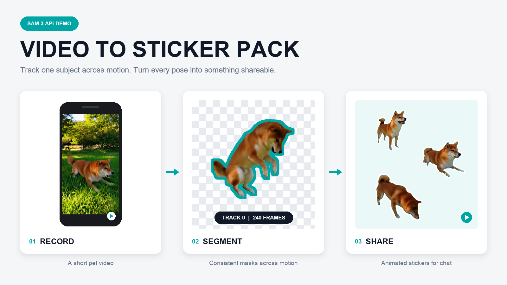

# Turn a pet video into an animated sticker pack

|                      |                                                               |
| -------------------- | ------------------------------------------------------------- |
| **Section**          | [Segment Anything Model](https://dev.meta.ai/docs/cookbook/sam) |
| **Docs**             | [Media segmentation](https://dev.meta.ai/docs/media-segmentation) · [Reading segmentation output](https://dev.meta.ai/docs/sam/reading-segmentation) · [Client libraries](https://dev.meta.ai/docs/sam/client-libraries) |
| **Time to complete** | ~15 min                                                       |
| **Model**            | `sam-3.1`                                               |
| **Languages**        | JavaScript and Python                                         |
| **Prerequisites**    | Node.js 20.17+, Python 3.10+, FFmpeg, curl, and a `MODEL_API_KEY` (create one in the [Model API dashboard](https://dev.meta.ai/)) |

Give the recipe a video and an object noun such as `dog`, `cat`, `horse`, or
`bird`. Segment Anything Model 3.1 (SAM 3.1) tracks every matching subject through the video. The recipe
uses the longest-lived matching track to remove the background, selects three
high-motion moments, and exports a transparent animated sticker pack.



## How it works

1. FFmpeg limits the video's longest edge while preserving every source frame.
2. `create-segmented-gif.mjs` uploads the video, requests the object by name,
   and parses the streamed masks with `@meta-sam/parser`.
3. The script selects the longest-lived object track, applies each mask to its
   exact source frame, smooths crop motion, and creates a lossless transparent
   APNG intermediate.
4. `make-sticker-pack.py` picks a high-motion clip from each third of the
   animation and packages the clips as animated WebP stickers.

SAM supplies the temporal object identity and pixel masks. The remaining image
operations are deterministic and do not call another vision model.

## Setup

```bash
cd 07_sam/02_video_to_sticker_pack
python3 -m venv .venv
source .venv/bin/activate
pip install -r requirements.txt
npm install
export MODEL_API_KEY="your-model-api-key"
```

`npm install` pulls `@meta-sam/parser` from npm. To develop against unreleased
parser changes, build a local
[`meta-sam`](https://github.com/meta-models/meta-sam) checkout and install
its parser over the published one:

```bash
cd /path/to/meta-sam/typescript
npm install
npm run build
cd /path/to/meta-model-cookbook/07_sam/02_video_to_sticker_pack
npm install --no-save /path/to/meta-sam/typescript/packages/parser
```

## Run

The bundled `shiba_jump.mp4` is a 10-second pet clip you can run straight away:

```bash
python make-sticker-pack.py assets/shiba_jump.mp4 \
  --object dog \
  --output output/my-dog
```

Point the same command at your own video and use another concrete noun, without
changing the code:

```bash
python make-sticker-pack.py my-cat-video.mp4 \
  --object cat \
  --output output/my-cat
```

The default preprocessing preserves the source frame rate and limits the longest
video edge to 960 pixels. Use `--analysis-fps` only when deliberately sampling
frames, or change `--max-dimension` to trade spatial detail for latency.

When several matching animals appear, the recipe selects the track present in
the most frames. Pass `--track-id ID` to choose another track. During design
iteration, reuse a saved response without another model call:

```bash
python make-sticker-pack.py assets/shiba_jump.mp4 \
  --object dog \
  --events output/my-dog/segmentation/events.ndjson \
  --output output/my-dog-revised
```

## Output

| File                                        | Purpose                                                                 |
| ------------------------------------------- | ----------------------------------------------------------------------- |
| `sticker-01.webp` through `sticker-03.webp` | 512x512 transparent animated stickers, each under 500 KB                |
| `sticker-*-preview.gif`                     | Browser-friendly transparent previews                                   |
| `tray.png`                                  | 96x96 pack icon                                                         |
| `contents.json`                             | WhatsApp-style sticker pack manifest                                    |
| `pack-preview.png`                          | Contact sheet for reviewing the selected poses                          |
| `report.json`                               | Source frames, encoding choices, API timings, and constraints           |
| `segmentation/`                             | Parsed SAM output, raw stream events, summary, and lossless cutout APNG |

The preview above comes from a real run of the bundled clip. SAM tracked the dog
in all 240 source frames. The three resulting 2.5-second stickers are capped at
15 FPS, contain 31 frames each, and remain below 500 KB.

Each sticker covers one third of the animation: the recipe scores frame-to-frame
motion on the cutout, then keeps the highest-motion window in each third, so the
three poses are always spread across the clip rather than clustered.

To adjust sticker selection without calling the API again, pass an existing
`segmented-subject.png` APNG to the same command, or pass a saved
`events.ndjson` with `--events` to rerun mask compositing against the source
video.
