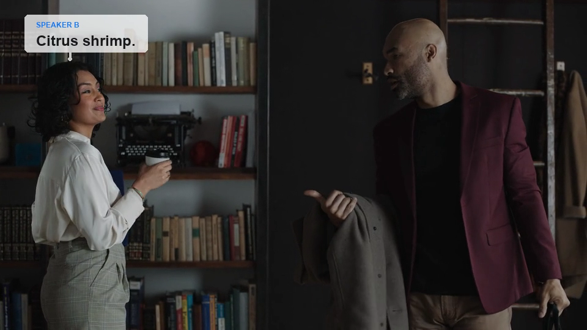

# Build multi-speaker headlocked captions

|  |  |
|---|---|
| **Section** | [Segment Anything Model](https://dev.meta.ai/docs/cookbook/sam) |
| **Docs** | [Media segmentation](https://dev.meta.ai/docs/media-segmentation) · [Reading segmentation output](https://dev.meta.ai/docs/sam/reading-segmentation) · [Speech to text](https://dev.meta.ai/docs/speech-to-text) |
| **Time to complete** | ~20 min |
| **Models** | `sam-3.1`, `muse-voice-transcribe-1.0` |
| **Languages** | React, TypeScript, JavaScript, and Python |
| **Prerequisites** | Node.js 22.22.2+, Python 3.10+ with Pillow, FFmpeg, and a `MODEL_API_KEY` (create one in the [Model API dashboard](https://dev.meta.ai/)) |

Upload a conversation video, watch Muse Voice and Segment Anything Model 3.1 (SAM 3.1) analyze it in parallel,
match each anonymous voice to a tracked person, preview collision-aware speech
bubbles, and download the rendered MP4.



## Try the included videos

| File | Purpose |
|---|---|
| [sample-input.mp4](assets/sample-input.mp4) | Original 16-second, two-speaker source video |
| [sample-output.mp4](assets/sample-output.mp4) | Rendered video produced by this app |

## How it works

1. The local Express server receives an uploaded video. Model API keys stay on
   the server and are never sent to the browser.
2. Muse Voice diarization and one SAM request for `people` run in parallel.
3. SAM returns every matching object and its encoded pixel mask. The data
   builder filters tiny detections and reconnects track fragments across camera
   cuts without relying on clothing descriptions.
4. `@meta-sam/react` renders the analysis video and SAM masks on one canvas.
   Its `@meta-sam/video` player uses exact packet frame indexes, so masks do not
   drift or offset from the displayed video. The user listens to each voice
   sample and selects the corresponding person.
5. During preview, `@meta-sam/graphics` hides non-speaker tracks and highlights
   the active speaker. The layout planner derives a head anchor from the pixel
   mask, keeps each caption chunk on a stable side, avoids other people, and
   connects the bubble to the top of the speaker silhouette.
6. Python, Pillow, and FFmpeg render the selected mapping into a downloadable
   H.264 MP4 with the original audio.

The model APIs currently process uploaded files rather than exposing live frame
inference. The progress UI updates while both calls run; masks and transcript
turns become interactive as soon as analysis completes.

## Setup

```bash
cd 07_sam/03_headlocked_speech_bubble_captions
python3 -m venv .venv
source .venv/bin/activate
pip install -r requirements.txt
npm install

export MODEL_API_KEY="your-model-api-key"
```

`npm install` pulls `@meta-sam/parser`, `@meta-sam/graphics`, `@meta-sam/video`,
and `@meta-sam/react` from npm. To develop against unreleased parser changes,
build a local [`meta-sam`](https://github.com/meta-models/meta-sam) checkout
and install the four packages over the published ones:

```bash
cd /path/to/meta-sam
cd typescript
npm ci
npm run build
python -m pip install ../python
cd /path/to/meta-model-cookbook/07_sam/03_headlocked_speech_bubble_captions
npm install --no-save \
  /path/to/meta-sam/typescript/packages/parser \
  /path/to/meta-sam/typescript/packages/graphics \
  /path/to/meta-sam/typescript/packages/video \
  /path/to/meta-sam/typescript/packages/react
```

## Run the app

```bash
npm run dev
```

Open `http://127.0.0.1:5174`, upload a video, and complete the two mapping
steps. After previewing the captions, select **Render video** and then
**Download MP4**.

Uploaded videos and generated model artifacts are stored under `runtime/` and
ignored by source control.

## Run the model steps directly

```bash
python scripts/transcribe.py input.mp4 --output work/transcript.json

node scripts/segment-people.mjs \
  --input input.mp4 \
  --object "people" \
  --output work/sam-people

python scripts/build-demo-data.py \
  --transcript work/transcript.json \
  --tracks work/sam-people/tracks.json \
  --segmentation work/sam-people/segmentation.json \
  --output public/demo-data.json
```

The default preprocessing preserves the source frame rate and limits the longest
video edge to 960 pixels, so the rendered MP4 matches that analysis size rather
than the source. Use `--fps` only when deliberately sampling frames, or raise
`--max-dimension` to trade latency for a larger render.

For distant subjects, lower the configurable `--min-area-ratio` value instead
of changing the prompt to clothing or another video-specific description.

## Verify

```bash
npm test
npm run lint
npm run build
python -m py_compile scripts/*.py
```
